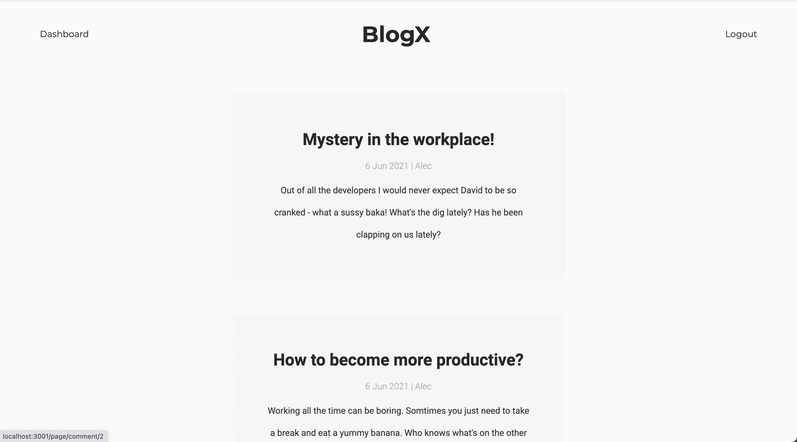
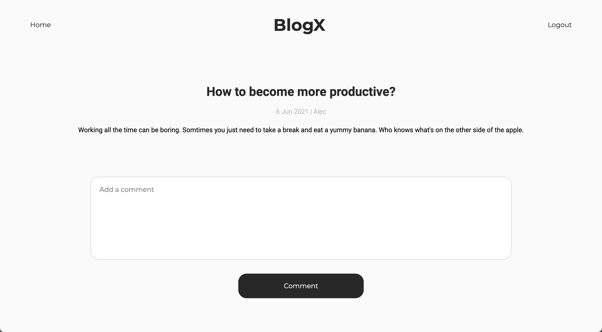
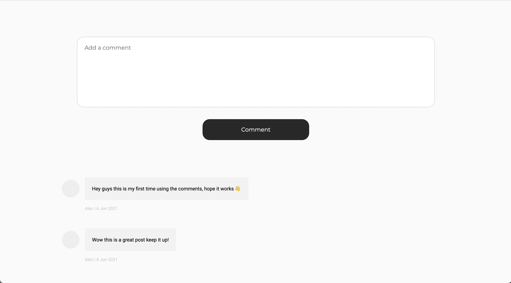
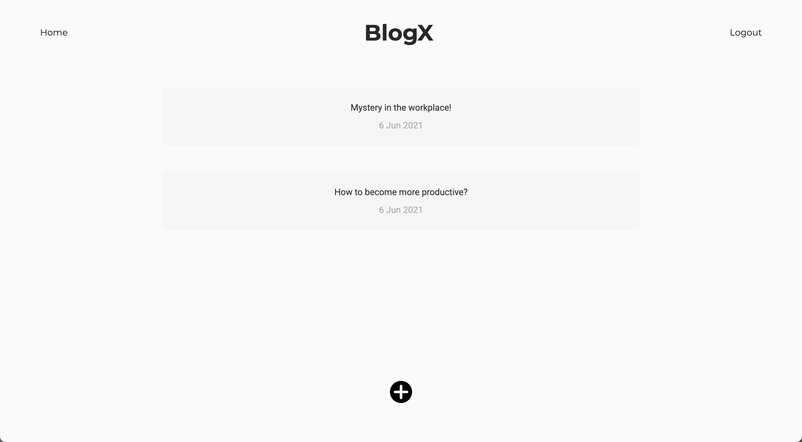
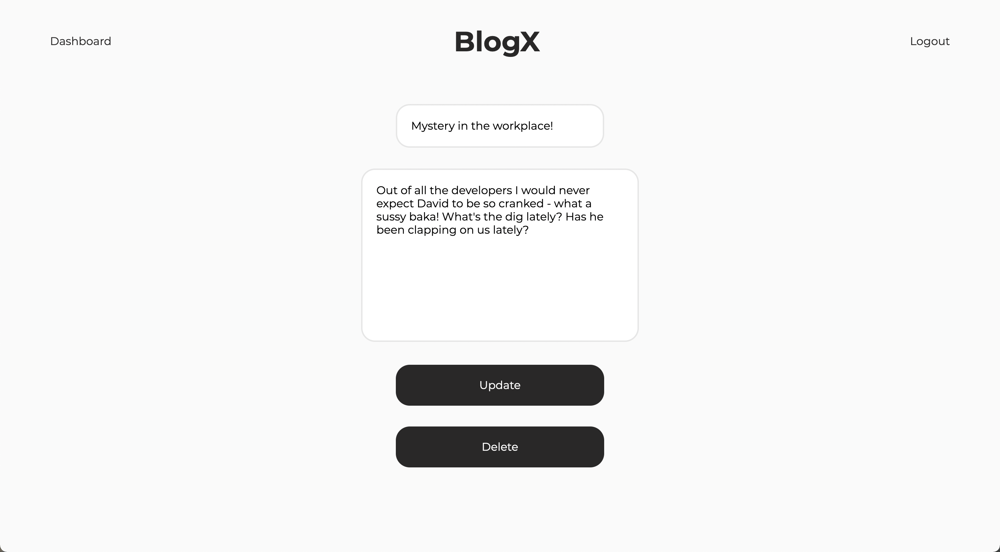
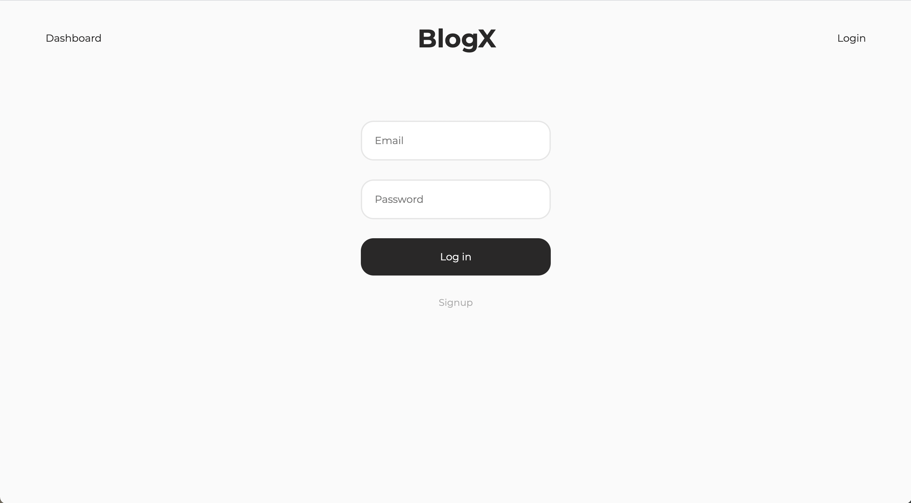

# Tech-Blog

A full-stack web application that allows you to write and read blogs | Deployed On Heroku

## Deployment

My Tech Blog has been deployed here:
[BlogX](https://infinite-earth-35208.herokuapp.com/)

## Why make this?

I made this application to get a better grasp of full stack development. I was able to develop both the front end and back end code.

## My goal

I wanted the final application to be as user friendly as possible and that's why I did not neglect the user interface. I distracted the users with the client side so that they didn't really notice that everything was being kept in a database. I also focused on security, preventing people with malicious intent to destroy other people's posts. I considered every problem that the user could run into for example, if there were no posts, I would display visual icons to explained the issue at hand.

## Home

## Post

## Comments

## Empty Dashboard

## Dashboard

## Edit

## Login

## End note

I hope you enjoyed going through my social media platform :)
